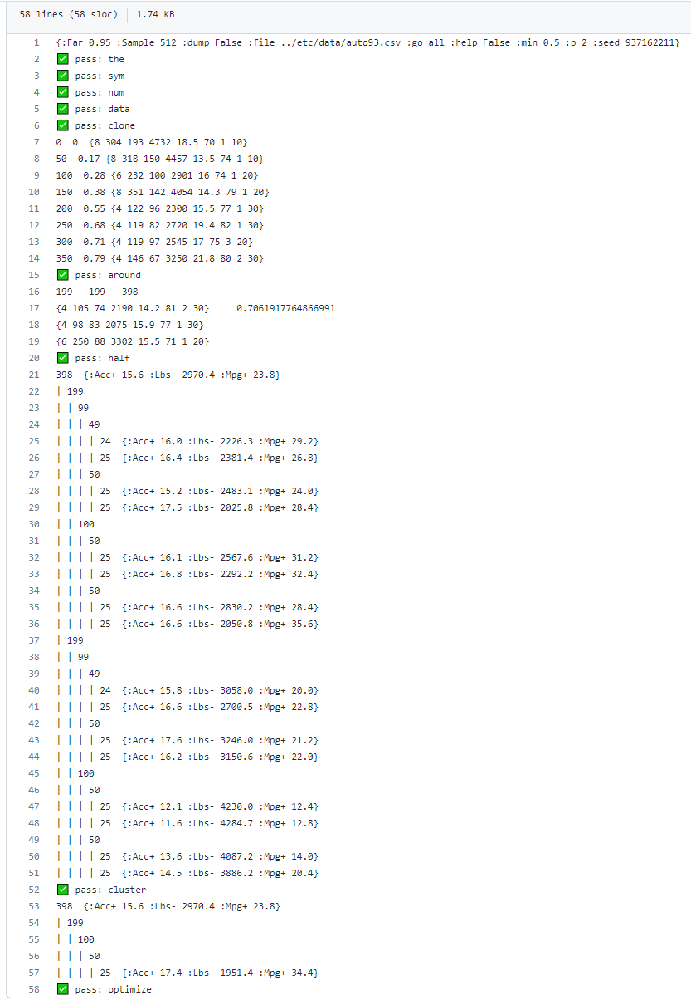

# cluster

## This is the README file of HW3-cluser (CSC 591, 2023)
There are some classes and their basic functions defined:

Classes:
* NUM
* SYM
* ROW
* COL
* DATA

Some functions:
* etc (old)
* map
* rand
* around
* half
* cluster
* optimize

And some test examples

## Result:
* [Expected result](https://github.com/timm/tested/blob/main/etc/out/cluster.out):

* [Result](https://github.com/yzhu27/cluster/blob/main/etc/out/cluster.out):

## Contributors:
* Jiayuan Huang [jhuang52]
* Mengzhe Wang [mwang39]
* Yuheng Zhu [yzhu63]
